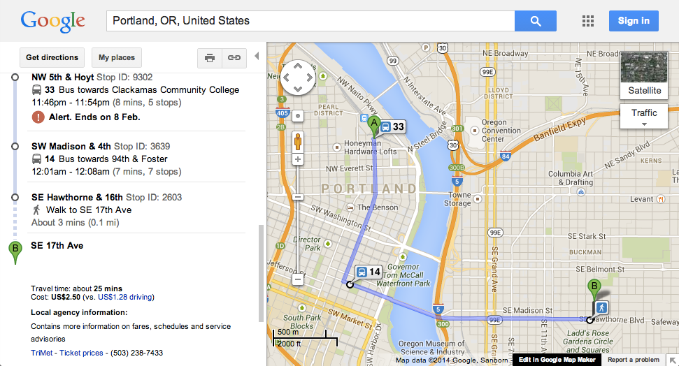

## 2. Agencies (agency.txt)

*This file is ***required*** to be included in GTFS feeds.*

The `agency.txt` file is used to represent the agencies that provide
data for this feed. While its presence is optional, if there are routes
from multiple agencies included, then records in `routes.txt` make
reference to agencies in this file.

| Field  | Required? | Description |
| :----------------------------------------------------- | :--------: | :-------- |
| `agency_id`                                            | Optional | An ID that uniquely identifies a single transit agency in the feed. If a feed only contains routes for a single agency then this value is optional. |
| `agency_name`                                          | Required | The full name of the transit agency. |
| `agency_url`                                           | Required | The URL of the transit agency. Must be a complete URL only, beginning with `http://` or `https://`. |
| `agency_timezone`                                      | Required | Time zone of agency. All times in `stop_times.txt` use this time zone, unless overridden by its corresponding stop. All agencies in a single feed must use the same time zone. Example: **America/New_York** (See <http://en.wikipedia.org/wiki/List_of_tz_database_time_zones> for more examples) |
| `agency_lang`                                          | Required | Contains a two-letter ISO-639-1 code (such as `en` or `EN` for English) for the language used in this feed. |
| `agency_phone`                                         | Optional | A single voice telephone number for the agency that users can dial if required. |
| `agency_fare_url`                                      | Optional | A URL that describes fare information for the agency. Must be a complete URL only, beginning with `http://` or `https://`. |

### Sample Data

The following extract is taken from the GTFS feed of TriMet (Portland,
USA), located at <https://openmobilitydata.org/p/trimet>.

| `agency_name` | `agency_url`                                 | `agency_timezone`     | `agency_lang` | `agency_phone`   |
| :------------ | :------------------------------------------- | :-------------------- | :------------ | :--------------- |
| `TriMet`      | `[https://trimets.org](https://trimet.org/)` | `America/Los_Angeles` | `en`          | `(503) 238-7433` | 

In this example, the `agency_id` column is included, but as there is
only a single entry the value can be empty. This means the `agency_id`
column in `routes.txt` also is not required.

### Discussion

The data in this file is typically used to provide additional
information to users of your app or web site in case schedules derived
from the rest of this feed are not sufficient (or in the case of
`agency_fare_url`, an easy way to provide a reference point to users
if the fare information in the feed is not being used).

If you refer to the following screenshot, taken from Google Maps, you
can see the information from `agency.txt` represented in the
lower-left corner as an example of how it can be used.

