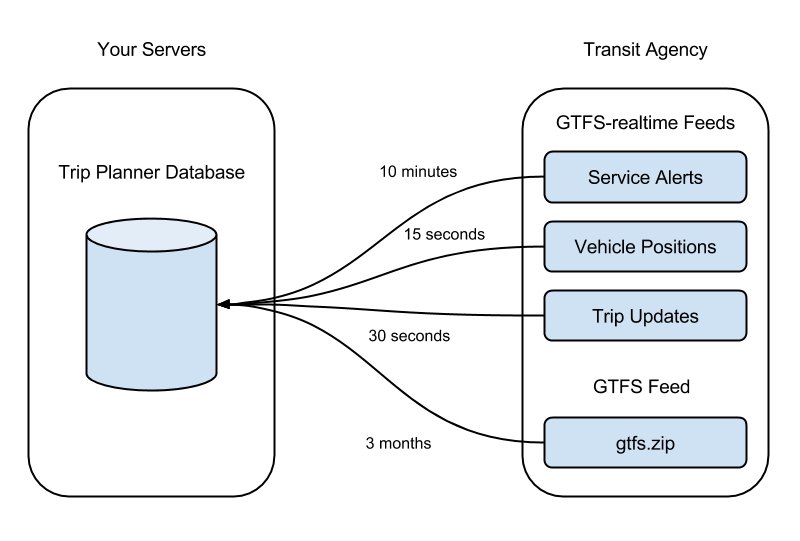

## 1. Introduction to GTFS-realtime

GTFS-realtime is a standard developed by Google in order to allow
transit agencies to provide real-time information about their service.

There are three types of data a GTFS-realtime feed provides:

1. Vehicle positions
2. Trip updates
3. Service alerts

Vehicle positions contain data about events that have already occurred
(e.g. "the vehicle was at this location one minute ago"), whereas trip
updates contain data about events that are yet to occur (e.g. "the bus
will arrive in three minutes").

Typically, a single GTFS-realtime feed contains only one of these three
types of data. Many agencies therefore have multiple GTFS-realtime feeds
(that is, one for vehicle positions, one for trip updates and one for
service alerts).

The above diagram shows how a GTFS-realtime feed is designed to
complement a GTFS (General Transit Feed Specification) feed. It does
this in two ways:

1. All identifiers for routes, trips and stops match those that appear
   in the corresponding GTFS feed.
2. A GTFS feed shows the projected schedule for a given period (such as
   the next six months), while the GTFS-realtime is used to make
   last-minute adjustments based on real-world conditions (such as
   traffic, roadworks, or weather).

### Consuming GTFS-realtime Feeds

The format of GTFS-realtime feeds is based on Protocol Buffers, a
language and platform-neutral mechanism for serializing structured data.

This is similar conceptually to JSON (JavaScript Object Notation), but
the data transferred across the wire is binary data and not
human-readable in its raw format.

*Chapter 5. Protocol Buffers* shows you how to use Protocol
Buffers and the associated **gtfs-realtime.proto** file (used to
instruct Protocol Buffers how GTFS-realtime is structured).

Consuming GTFS-realtime Feeds on Mobile Devices

A common use-case for GTFS and GTFS-realtime feeds is to build
transit-related mobile apps that show scheduling data. However, it is
important to note that GTFS-realtime feeds are not intended to be
consumed directly by a mobile device.

Many of the vehicle positions and trip update feeds provided by transit
agencies include a snapshot of their entire network at a single moment.
For a large network, this could be multiple megabytes of data being
updated every 10-15 seconds.

A mobile app downloading a full GTFS-realtime feed every 10-15 seconds
would quickly download a large amount of data over their cellular
connection, which could be very expensive. Additionally, their device
would need to process a large amount of data -- most of which would not
be relevant -- which would run down their battery unnecessarily. This
would also put a huge amount of strain on the provider's servers.

Rather, GTFS-realtime is intended to be consumed by an intermediate
server. In the case of a mobile app, this intermediate server would
likely belong to the creator of the app. The mobile app can then query
this intermediate server for the relevant data it needs at that time.

The above diagram demonstrates the different models. On the left, mobile
devices download entire GTFS-realtime feeds from the provider. Each
device is downloading 5 megabytes every 10-15 seconds.

On the right, an intermediate server records all vehicle positions, then
mobile devices request only the data they need. This significantly
reduces the amount of data transferred.

