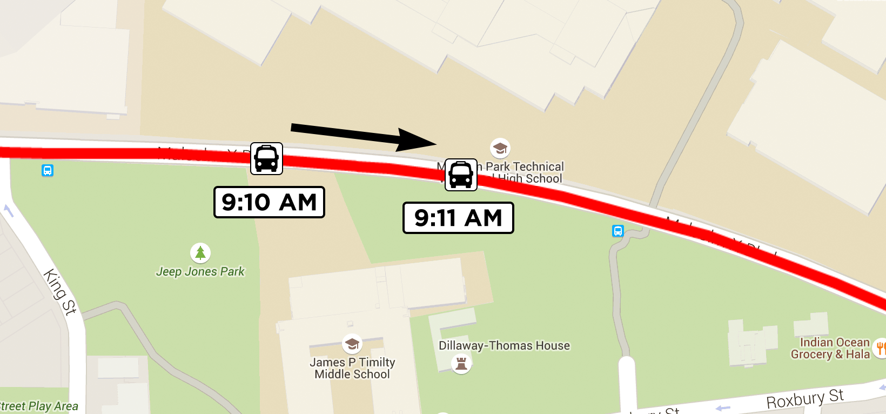

## 7. Consuming Vehicle Positions

Just like when consuming service alerts, you can loop over the
`FeedEntity` objects returned from `getEntityList()` to process
vehicle positions. If an entity contains a vehicle position, you can
retrieve it using the `getVehicle()` method.

```java
for (FeedEntity entity : fm.getEntityList()) {
    if (entity.hasAlert()) {
        VehiclePosition vp = entity.getVehicle();
        processVehiclePosition(vp);
    }
}
```

You can then process the returned `VehiclePosition` object to extract
the details of the vehicle position.

### Timestamp

One of the provided values is a timestamp reading of when the vehicle
position reading was taken.

```java
if (vp.hasTimestamp()) {
    Date timestamp = new Date(vp.getTimestamp() * 1000);

}
```

***Note:** The value is multiplied by 1,000 because the java.util.Date
class accepts milliseconds, whereas GTFS-realtime uses whole seconds.*

This value is useful because the age of a reading can dictate how the
data is interpreted. For example, if your latest reading was only thirty
seconds earlier, your users would realize it is very recent and
therefore is probably quite accurate. On the other hand, if the latest
reading was ten minutes earlier, they would see it had not updated
recently and may therefore not be completely accurate.

The other way this value is useful is for determining whether to store
this new vehicle position. If your previous reading for the same vehicle
has the same timestamp, you can ignore this update, as nothing has
changed.

### Geographic Location

A `VehiclePosition` object contains a `Position` object, which
contains a vehicle's latitude and longitude, and may also include other
useful information such as its bearing and speed.

```java
public static void processVehiclePosition(VehiclePosition vp) {
    if (vp.hasPosition()) {
        Position position = vp.getPosition();

        if (position.hasLatitude() && position.hasLongitude()) {
            float latitude = position.getLatitude();
            float longitude = position.getLongitude();

            // ...
        }

        // ...
    }
}
```

Even though the `Position` element of a `VehiclePosition` is
required (according to the specification), checking for it explicitly
means you can handle its omission gracefully. Remember: when consuming
GTFS-realtime data you are likely to be relying on a third-party data
provider who may or may not follow the specification correctly.

Likewise, the latitude and longitude are also required, but it is still
prudent to ensure they are included. These values are treated as any
floating-point numbers, so technically they may not be valid geographic
coordinates.

A basic check to ensure the coordinates are valid is to ensure the
latitude is between -90 and 90 and the longitude is between -180 and
180.

```java
float latitude = position.getLatitude();
float longitude = position.getLongitude();

if (Math.abs(latitude) <= 90 && Math.abs(longitude) <= 180) {
  // Valid coordinate

}
else {
  // Invalid coordinate
  
}
```

A more advanced check would be to determine a bounding box of the data
provider's entire public transportation network from the corresponding
GTFS feed's `stops.txt`. You would then check that all received
coordinates are within or near the bounding box.

***Note:** The important lesson to take from this is that a GTFS-realtime
feed may appear to adhere to the specification, but you should still
perform your own sanity checks on received data.*

In addition to the latitude and longitude, you can also retrieve a
vehicle's speed, bearing and odometer reading.

```java
if (position.hasBearing()) {
  float bearing = position.getBearing();

  // Degrees from 0-359. 0 is North, 90 is East, 180 is South, 270 is West

}

if (position.hasOdometer()) {
  double odometer = position.getOdometer();

  // Meters
}

if (position.hasSpeed()) {
  float speed = position.getSpeed();
  
  // Meters per second
}
```

### Trip Information

In order to associate a vehicle position with a particular trip from the
corresponding GTFS feed, vehicle positions may include a trip
descriptor.

***Note:** The trip descriptor is declared as optional in the
GTFS-realtime specification. Realistically, it will be hard to provide
value to end-users without knowing which trip the position corresponds
to. At the very least, you would need to know the route (which can be
specified via the trip descriptor).*

Just like with service alerts (covered in the previous chapter), there
are a number of values you can retrieve from a trip descriptor to
determine which trip a vehicle position belongs to. The following
listing demonstrates how to access this data:

```java
if (vp.hasTrip()) {
  TripDescriptor trip = vp.getTrip();

  if (trip.hasTripId()) {
    String tripId = trip.getTripId();

  }

  if (trip.hasRouteId()) {
    String routeId = trip.getRouteId();

  }

  if (trip.hasStartDate()) {
    String startDate = trip.getStartDate();
    
  }

  if (trip.hasStartTime()) {
    String startTime = trip.getStartTime();

  }

  if (trip.hasScheduleRelationship()) {
    ScheduleRelationship sr = trip.getScheduleRelationship();

  }
}
```

### Vehicle Identifiers

There are a number of values available in a vehicle position entity by
which to identify a vehicle. You can access an internal identifier (not
for public display), a label (such as a vehicle number painted on to a
vehicle), or a license plate, as shown in the following listing:

```java
if (vp.hasVehicle()) {
  VehicleDescriptor vehicle = vp.getVehicle();

  if (vehicle.hasId()) {
    String id = vehicle.getId();

  }

  if (vehicle.hasLabel()) {
    String label = vehicle.getLabel();

  }

  if (vehicle.hasLicensePlate()) {
    String licensePlate = vehicle.getLicensePlate();

  }
}
```

The vehicle descriptor and the values contained within are all optional.
In the case where this information is not available, you can use the
trip descriptor provided with each vehicle position to match up vehicle
positions across multiple updates.

Being able to match up the trip and/or vehicle reliably over subsequent
updates allows you reliably track the ongoing position changes for a
particular vehicle. For instance, if you wanted to animate the vehicle
moving on a map as new positions were received, you would need to know
that each update corresponds to a particular vehicle.

### Current Stop

Each vehicle position record can be associated with a single stop. If
specified, this stop must appear in the corresponding GTFS feed.

The stop can be identified either by the `stop_id` value, or by using
the `current_stop_sequence` value. If you use the stop sequence, the
stop can be determined by finding the corresponding record in the GTFS
feed's `stop_times.txt` file.

```java
if (vp.hasStopId()) {
  String stopId = vp.getStopId();

}

if (vp.hasCurrentStopSequence()) {
  int sequence = vp.getCurrentStopSequence();

}
```

***Note:** It is possible for the same stop to be visited multiple times
in a single trip (consider a loop service, although there are other
instances when this may also happen). The stop sequence value can be
useful to disambiguate this case.*

On its own, knowing the stop has no meaning without context. The
`current_status` field provides this context, indicating that the
vehicle is either:

* In transit to the stop (it is the next stop but the vehicle is not yet nearby)
* About to arrive at the stop
* Currently stopped at the stop.

According to the GTFS-realtime specification, you can only make use of
`current_status` if the stop sequence is specified.

The following code shows how you can retrieve and check the value of the
stop status.

```java
if (vp.hasCurrentStopSequence()) {
  int sequence = vp.getCurrentStopSequence();

  if (vp.hasCurrentStatus()) {
    VehicleStopStatus status = vp.getCurrentStatus();

    switch (status.getNumber()) {
    case VehicleStopStatus.IN_TRANSIT_TO_VALUE:
      // ...

    case VehicleStopStatus.INCOMING_AT_VALUE:
      // ...

    case VehicleStopStatus.STOPPED_AT_VALUE:
      // ...

    }
  }
}
```

### Congestion Levels

The other two values that may be included with a vehicle position relate
to the congestion inside and outside of the vehicle.

The `congestion_level` value indicates the flow of traffic. This value does
not indicate whether or not the vehicle is running to schedule, since congestion
levels are typically accounted for in scheduling.

The following code shows how you can check the congestion level value:

```java
if (vp.hasCongestionLevel()) {
  CongestionLevel congestion = vp.getCongestionLevel();

  switch (congestion.getNumber()) {
  case CongestionLevel.UNKNOWN_CONGESTION_LEVEL_VALUE:
    // ...

  case CongestionLevel.RUNNING_SMOOTHLY_VALUE:
    // ...

  case CongestionLevel.STOP_AND_GO_VALUE:
    // ...

  case CongestionLevel.SEVERE_CONGESTION_VALUE:
    // ...

  case CongestionLevel.CONGESTION_VALUE:
    // ...
    
  }
}
```

The `occupancy_status` value indicates how full the vehicle currently
is. This can be useful to present to your users so they know what to
expect before the vehicle arrives. For instance:

* A person with a broken leg may not want to travel on a standing
  room-only bus
* Someone traveling late at night might prefer a taxi over an empty
  train for safety reasons
* If a bus is full and not accepting passengers, someone may stay at
  home for longer until a bus with seats is coming by.

You can check the occupancy status of a vehicle as follows:

```java
if (vp.hasOccupancyStatus()) {
  OccupancyStatus status = vp.getOccupancyStatus();

  switch (status.getNumber()) {
  case OccupancyStatus.EMPTY_VALUE:
    // ...

  case OccupancyStatus.MANY_SEATS_AVAILABLE_VALUE:
    // ...

  case OccupancyStatus.FEW_SEATS_AVAILABLE_VALUE:
    // ...

  case OccupancyStatus.STANDING_ROOM_ONLY_VALUE:
    // ...

  case OccupancyStatus.CRUSHED_STANDING_ROOM_ONLY_VALUE:
    // ...

  case OccupancyStatus.FULL_VALUE:
    // ...

  case OccupancyStatus.NOT_ACCEPTING_PASSENGERS_VALUE:
    // ...

  }
}
```

### Determining a Vehicle's Bearing

One of the values that can be specified in a GTFS-realtime vehicle
position update is the bearing of the vehicle being reported. This value
indicates either the direction the vehicle is facing, or the direction
towards the next stop.

Ideally, the bearing contains the actual direction that the vehicle is
facing, not the direction to the next stop, since it is possible for
this value to be inaccurate. For example, if a Northbound vehicle is
stopped at a stop (that is, directly beside it), then the calculated
bearing would indicate the vehicle was facing East, not North.

***Note:** This example assumes that the vehicle is in a country that
drives on the right-hand side of the road.*

There are several ways to calculate a vehicle's bearing if it is not
specified in a GTFS-realtime feed:

* Determine the direction towards the next stop
* Determine the direction using a previous vehicle position reading
* A combination of the above.

***Note:** The GTFS-realtime specification states that feed providers
should not include the bearing if it is calculated using previous
positions. This is because consumers of the feed can calculate this, as
shown in the remainder of this chapter.*

### Bearing to Next Stop

In order to determine the bearing from the current location to the next
stop, there are two values you need:

* **Vehicle position.** This is provided in the `latitude` and
  `longitude` fields of the vehicle position.
* **Position of the next stop.** This is provided by the `stop_id`
  or `current_stop_sequence` fields of the vehicle position.

***Note:** Many GTFS-realtime vehicle position feeds do not include
information about the next stop, and consequently this technique will
not work in those instances. If this is the case, using the previous
reading to determine the bearing would be used, as shown later in
*Bearing From Previous Position*.*

The following formula is used to determine the bearing between the
starting location and the next stop:

```
θ = atan2( sin Δλ ⋅ cos φ2 , cos φ1 ⋅ sin φ2 − sin φ1 ⋅ cos φ2 ⋅ cos Δλ )
```

In this equation, the starting point is indicated by *1*, while the next
stop is represented by *2*. Latitude is represented by *φ*, while
longitude is represented by *λ*. For example, *φ2* means the latitude of
the next stop.

The resultant value *θ* is the bearing between the two points in
*radians*, and must then be converted to degrees (0-360).

This equation can be represented in Java as follows. It accepts that
latitude and longitude of two points in degrees, and returns the bearing
in degrees.

```java
public static double calculateBearing(double lat1Deg, double lon1Deg, double lat2Deg, double lon2Deg) {

  // Convert all degrees to radians
  double lat1 = Math.toRadians(lat1Deg);
  double lon1 = Math.toRadians(lon2Deg);
  double lat2 = Math.toRadians(lat2Deg);
  double lon2 = Math.toRadians(lon2Deg);

  // sin Δλ ⋅ cos φ2
  double y = Math.sin(lon2 - lon1) * Math.cos(lat2);

  // cos φ1 ⋅ sin φ2 − sin φ1 ⋅ cos φ2 ⋅ cos Δλ
  double x = Math.cos(lat1) * Math.sin(lat2) - Math.sin(lat1) * Math.cos(lat2) * Math.cos(lon2 - lon1);

  // Calculate the bearing in radians
  double bearingRad = Math.atan2(y, x);

  // Convert radians to degrees
  double bearingDeg = Math.toDegrees(bearingRad);

  // Ensure x is positive, in the range of 0 <= x < 360
  if (bearingDeg < 0) {
    bearingDeg += 360;
  }

  return bearingDeg;
}
```

One thing to be aware of when using the next stop to determine bearing
is the `current_status` value of the vehicle position (if specified).
If the value is `STOPPED_AT`, then the calculated angle might be
significantly wrong, since the vehicle is likely directly next to the
stop. In this instance, you should either use the next stop, or
determine the bearing from the previous position reading.

### Bearing From Previous Position

Similar to calculating a vehicle's bearing using the direction to the
next stop, you can also use a previous reading to calculate the
vehicle's direction.

The following diagram shows two readings for the same vehicle, as well
as the calculated bearing from the first point to the second.



To calculate the bearing in this way, you need the following data:

* **Current vehicle position.** This is provided in the `latitude`
  and `longitude` fields of the vehicle position.
* **Previous vehicle position.** This should be the most recent
  vehicle position recorded prior to receiving the current vehicle
  position. Additionally, this position must represent a different
  location to the current position. If a vehicle is stationary for
  several minutes, you may receive several locations for the vehicle
  with the same coordinates.

***Note:** In the case of multiple readings at the same location, you
should use a minimum distance threshold to decide whether or not the
location is the same. For instance, you may decide that the two previous
locations must be more than, say, 10 meters to use it for comparison.*

It is also necessary to check the age of the previous reading. If the
previous reading is more than a minute or two old, it is likely that the
vehicle has travelled far enough to render the calculated bearing
meaningless.

### Combination

These two strategies are useful to approximate a vehicle's bearing if
it is not specified in a vehicle position message, but they are still
reliant on certain data being available.

The first technique needs to know the next stop, while the second needs
a previous vehicle position reading.

Your algorithm to determine a vehicle's position could be as follows:

* Use the provided bearing value in the vehicle position if this
  available.
* Otherwise, if you have a recent previous reading, calculate the
  direction using that and the current reading.
* Otherwise, if the next stop is known, show the bearing of the
  vehicle towards the stop.

