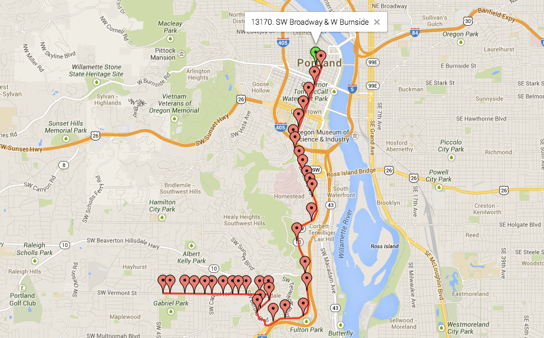

## 6. Stop Times (stop_times.txt)

*This file is ***required*** to be included in GTFS feeds.*

The `stop_times.txt` file specifies individual stop arrivals and
departures for each trip. This file is typically the largest in a GTFS
feed as it contains many records that correspond to each entry in
`trips.txt`.

| Field  | Required? | Description |
| :----- | :-------- | :---------- |
| `trip_id` | Required | References a trip from `trips.txt`. This ID is referenced for every stop in a trip. |
| `arrival_time` | Required | The arrival time in `HH:MM:SS` format. Can be left blank, except for at least the first and last stop time in a trip. This value is typically be the same as `departure_time`. |
| `departure_time` | Required | The departure time in `HH:MM:SS` format. Can be left blank, except for at least the first and last stop time in a trip. This value is typically be the same as `arrival_time`. |
| `stop_id` | Required | References a single stop from `stops.txt`. |
| `stop_sequence` | Required | A unique number for a given trip to indicate the stopping order. Typically these values appear in order and increment by 1 for each stop time, but this is not always the case. |
| `stop_headsign` | Optional | This is text that appears to passengers at this stop to identify the trip's destination. It should only be used to override the `trip_headsign` value from `trips.txt`. |
| `pickup_type` | Optional | Indicates if passengers can be picked up at this stop. Sometimes a stop is drop-off only. |
| `drop_off_type` | Optional | Indicates if passengers can be dropped off at this stop. Sometimes a stop is pick-up only. |
| `shape_dist_traveled` | Optional | If a trip has an associated shape, this value indicates how far along that shape the vehicle has traveled when at this stop. Values in this file and `shapes.txt` must use the same unit. |

### Sample Data

Consider the following extract, taken from stop_times.txt in the TriMet
GTFS feed (<https://openmobilitydata.org/p/trimet>). This represents the
first ten stops of a trip for bus route `1` ("Vermont") in Portland, as
covered in Sample Data for `trips.txt`.

| `trip_id` | `arrival_time` | `departure_time` | `stop_id` | `stop_sequence` | `shape_dist_traveled` |
| :-------- | :------------- | :--------------- | :-------- | :-------------- | :-------------------- |
| 4282247   | 06:47:00       | 06:47:00         | 13170     | 1               | 0.0                   |
| 4282247   | 06:48:18       | 06:48:18         | 7631      | 2               | 867.5                 |
| 4282247   | 06:50:13       | 06:50:13         | 7625      | 3               | 2154.9                |
| 4282247   | 06:52:07       | 06:52:07         | 7612      | 4               | 3425.5                |
| 4282247   | 06:53:42       | 06:53:42         | 7616      | 5               | 4491.1                |
| 4282247   | 06:55:16       | 06:55:16         | 10491     | 6               | 5536.2                |
| 4282247   | 06:57:06       | 06:57:06         | 7588      | 7               | 6767.1                |
| 4282247   | 06:58:00       | 06:58:00         | 7591      | 8               | 7364.4                |
| 4282247   | 06:58:32       | 06:58:32         | 175       | 9               | 8618.7                |
| 4282247   | 06:58:50       | 06:58:50         | 198       | 10              | 9283.8                |

If you were to plot the full trip on a map (including using its shape
file, as specified in `shapes.txt` and referenced in `trips.txt`),
it would look like the following diagram. The first stop is selected.

### Arrival Time vs. Departure Time

The first thing to notice about this data is that the values in
`arrival_time` and `departure_time` are the same. In reality, most
of the time these values are the same. The situation where these values
differ is typically when a vehicle is required to wait for a period of
time before departing. For instance:

**"The train departs the domestic airport at 6:30am, arrives at the
international terminal at 6:35am. It waits for 10 minutes for passengers
who have just landed to board, then departs for the city at 6:45am."**

While this is not typically something you need to worry about, be aware
that some feeds differ and the holdover time could be large. A person
rushing to a train wants to know the time it departs, while a husband
waiting at a stop to meet his wife wants to know what time it arrives.

**Note:** In a situation where the difference between the arrival time
and departure is small, you may be better off always displaying the
earlier time to the user. The driver may view a one or two minute
holdover as an opportunity to keep on time, whereas a ten or fifteen
minute holdover is unlikely to be ignored as doing so would
significantly alter the schedule.

### Scheduling Past Midnight

One of the most important concepts to understand about
`stop_times.txt` is that times later than midnight can be specified.
For example, if a trip starts at 11:45 PM and takes an hour to complete,
its finishing time is 12:45 AM the next day.

The `departure_time` value for the first stop is be `23:45:00`,
while the `arrival_time` value for the final stop is `24:45:00`.
If you were to specify the final arrival time as `00:45:00`, it
would be referencing 12:45 AM prior to the trip's starting time.

While you could use the `stop_sequence` to determine which day the
trip fell on, it would be impossible to do a quick search purely based
on the given final stop.

A trip may start and finish after midnight without being considered as
part of the next day's service. Many transit systems shut down
overnight, but may have a few services that run after midnight until
about 1 AM or 2 AM. It is logical to group them all together with the
same service as earlier trips, which this functionality allows you to
do.

However, this has implications when searching for trips. For instance,
if you want to find all trips between 12:00 AM and 1:00 AM on 30 January
2014, then you need to search:

* Between `00:00:00` and `01:00:00` for trips with service on `20140130`
* Between `24:00:00` and `25:00:00` for trips with service on` 20140129`

In *Searching for Trips* you can see how to apply this to your
trip searches.

### Time Points

Most GTFS feeds provide arrival/departure times for every single stop.
In reality, most agencies do not have known times (or at least, they do
not publish times) for many of their stops.

Typically, for routes that describe trains, subways or ferries that make
relatively few stops in a trip, all stops have a specified time.
However, often for bus routes that may make many stops in a single trip,
generally only the main stops have times shown on printed schedules.

Typically, the bus drivers are required to meet these time points; if
they are ahead of schedule they might wait at a time point until the
scheduled time; if they are running late they might try to catch up in
order to adhere to the specified time point.

This means that the intermediate points are likely estimates that have
been interpolated based on the amount of time between time points. If
there are multiple stops in-between the time points then the distance
between stops may also be used to calculate the estimate.

In actual fact, GTFS feeds do not have to specify times for all stops.
The data in the following table is perfectly valid for a trip.

| `trip_id` | `arrival_time` | `stop_id` | `stop_sequence` | `shape_dist_traveled` |
| :-------- | :------------- | :-------- | :-------------- | :-------------------- |
| T1        | 10:00:00       | S1        | 1               | 0                     |
| T1        |                | S2        | 2               | 1500                  |
| T1        |                | S3        | 3               | 3000                  |
| T1        | 10:12:00       | S4        | 4               | 6000                  |

Based on this data, without taking into account the distance traveled,
you may estimate that the second stop arrives at 10:04 AM while the
third stop arrives at 10:08.

If you consider the distance traveled, you might conclude the second
stop arrives at 10:03 AM while the third stop arrives at 10:06 AM.

Some agencies include an additional column in `stop_times.txt` called
`timepoint`. This is used when they specify the times for all stops
but also want to indicate if only certain stops are guaranteed times.

The following table shows how this would look using the previous data as
its basis.

|  `trip_id` | `arrival_time` | `stop_id` | `stop_sequence` | `shape_dist_traveled` | `timepoint` |
| :--------- | :------------- | :-------- | :-------------- | :-------------------- | :---------- |
|  T1        | 10:00:00       | S1        | 1               | 0                     | 1           |
|  T1        | 10:03:00       | S2        | 2               | 1500                  | 0           |
|  T1        | 10:06:00       | S3        | 3               | 3000                  | 0           |
|  T1        | 10:12:00       | S4        | 4               | 6000                  | 1           |

This can be especially useful if you want to highlight these time points
so as to represent the printed schedules accurately, or even if you are
a transit agency just using the data for internal reporting.

