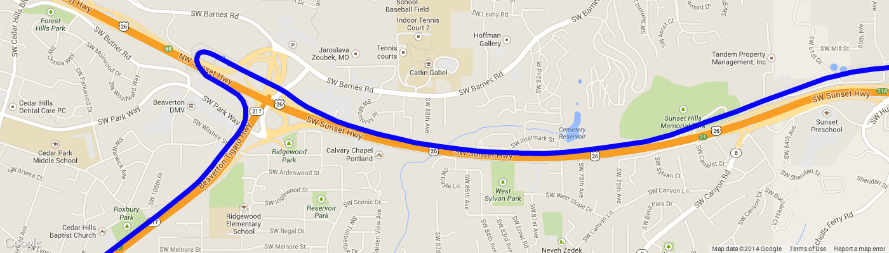
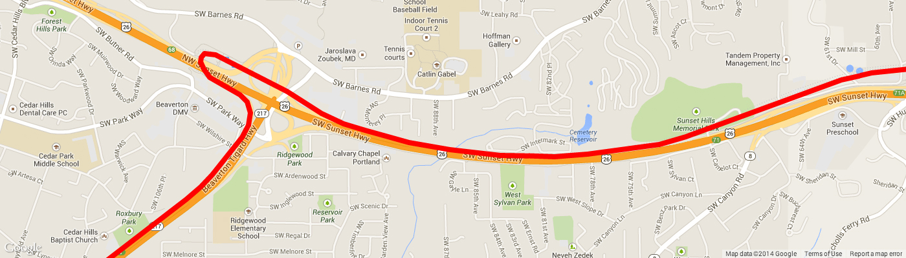
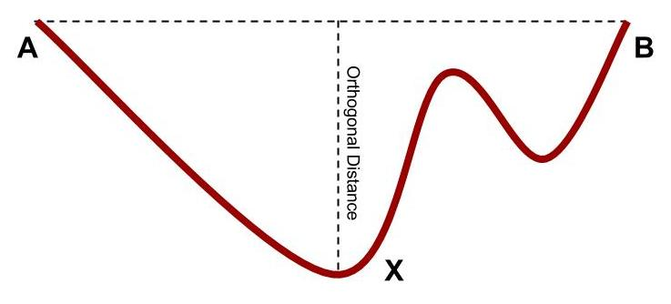

## 15. Optimizing Shapes

Shape data in a GTFS feed (that is, the records from `shapes.txt`)
represents a large amount of data. There are a number of ways to reduce
this data, which can help to:

* Speed up data retrieval
* Reduce the amount of data to transmit to app / web site users
* Speed up rendering of the shape onto a map (such as a native mobile
  map or a JavaScript map).

Two ways to reduce shape data are as follows:

* **Reducing the number of points in a shape.** The shapes included in
  GTFS are often very precise and include a number of redundant
  points. Many of these can be removed without a noticeable loss of
  shape quality using the *Douglas-Peucker Algorithm*.
* **Encoding all points in a shape into a single value.** The *Encoded
  Polyline Algorithm* used in the Google Maps JavaScript API can also
  be used with GTFS shapes. This reduces the amount of storage
  required and also makes looking up all points in a shape far
  quicker.

### Reducing Points in a Shape

Many of the shapes you find in GTFS feeds are extremely detailed. They
often follow the exact curvature of the road and may consist of hundreds
or thousands of points for a trip that might have only 30 or 40 stops.

While this level of detail is useful, the sheer amount of data required
to be rendered on a map can be a massive performance hit from the
perspective of retrieving the data as well as rendering on a map.
Realistically, shapes do not need this much detail in order to convey
their message to your users.

Consider the following shape from Portland that has been rendered using
Google Maps. The total shape consists of 1913 points.



Compare this now to the same shape that has had redundant points
removed. The total number of points in this shape is 175, which
represents about a 90% reduction.



If you look closely, you can see some minor loss of detail, but for the
most part, the shapes are almost identical.

This reduction in points can be achieved using the Douglas-Peucker
Algorithm. It does so by discarding points that do not deviate
significantly between its surrounding points.

The Douglas-Peucker Algorithm works as follows:

* Begin with the first and last points in the path (A and B). These
  are always kept.
* Find the point between the first and last that is furthest away from
  the line joining the first and last line (the orthogonal distance --
  see the figure below).
* If this point is greater than the allowed distance (the tolerance
  level), the point is kept (call it X).
* Repeat this algorithm twice: once using A as the first point and X
  as the last point, then again using X as the first point and B as
  the last point.

This algorithm is recursive, and continues until all points have been
checked.

***Note:** The tolerance level determines how aggressively points are
removed. A higher tolerance value is less aggressive and discards less
data, while a lower tolerance discards more data.*

The following diagram shows what orthogonal distance means.



The following resources provide more information about the
Douglas-Peucker Algorithm and describe how to implement it in your own
systems:

* <http://en.wikipedia.org/wiki/Ramer-Douglas-Peucker_algorithm>
* <http://www.loughrigg.org/rdp/>
* <http://stackoverflow.com/questions/2573997/reduce-number-of-points-in-line>.

You can often discard about 80-90% of all shape data before seeing a
significant loss of line detail.

### Encoding Shape Points

A single entry in `shapes.txt` corresponds to a single point in a
single shape. Each entry includes a shape ID, a latitude and longitude.

***Note:** The `shape_dist_traveled` field is also included, but you do not
strictly need to use this field (nor the corresponding field in
stop_times.txt). The technique described in this section will not work
if you intend to use `shape_dist_traveled`.*

This means if you want to look up a shape by its ID, you may need to
retrieve several hundreds of rows from a database. Using the Encoded
Polyline Algorithm you can change your GTFS database so each shape is
represented by a single row in a database. This means the shape can be
found much more quickly and much less data needs to be processed to
determine the shape.

Consider the following data, taken from TriMet's `shapes.txt` file.
This data represents the first five points of a shape.

| `shape_id` | `shape_pt_lat` | `shape_pt_lon` |  `shape_pt_sequence` |  `shape_dist_traveled` |
| :--------- | :------------- | :------------- | :------------------- | :--------------------- |
| `185328`   | `45.52291 `    | `-122.677372`  |  `1`                 |  `0.0`                 |
| `185328`   | `45.522921`    | `-122.67737`   |  `2`                 |  `3.7`                 |
| `185328`   | `45.522991`    | `-122.677432`  |  `3`                 |  `34.0`                |
| `185328`   | `45.522992`    | `-122.677246`  |  `4`                 |  `81.5`                |
| `185328`   | `45.523002`    | `-122.676567`  |  `5`                 |  `255.7`               |

If you apply the Encoded Polyline Algorithm to this data, the
coordinates can be represented using the following string.

```
eeztGrlwkVAAML?e@AgC
```

To learn how to arrive at this value, you can read up on the Encoded
Polyline Algorithm at
<https://developers.google.com/maps/documentation/utilities/polylinealgorithm>.

Instead of having every single shape point in a single table, you can
create a table that has one record per shape. The following SQL
statement is a way you could achieve this.

```sql
CREATE TABLE shapes (
  shape_id TEXT,
  encoded_shape TEXT
);
```

The following table shows how this data could be represented in a
database.

| `shape_id` | `encoded_shape`        |
| :--------- | :--------------------- |
| `185328`   | `eeztGrlwkVAAML?e@AgC` |

Storing the shape in this manner means you can retrieve an entire shape
by looking up only one database row and running it through your decoder.

To further demonstrate how both the encoding and decoding works, try out
the polyline utility at
<https://developers.google.com/maps/documentation/utilities/polylineutility>.

You can find implementations for encoding and decoding points for
various languages at the following locations:

* <http://facstaff.unca.edu/mcmcclur/GoogleMaps/EncodePolyline/>
* <https://github.com/emcconville/google-map-polyline-encoding-tool>

