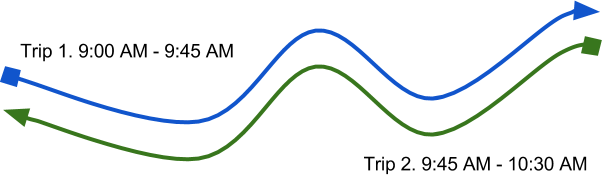
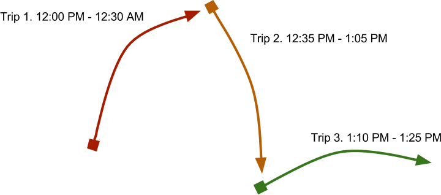

## 18. Working With Trip Blocks**

One of the more complex aspects of GTFS is how to properly use the
`block_id` field in `trips.txt`. The concept is simple, but
incorporating this information in a manner that is simple to understand
for a passenger can be more difficult.

A single vehicle (such as a bus or train) completes multiple trips in a
single service day. For instance, once a bus completes its trip (Trip X)
from Location A to Location B, it then begins another trip (Trip Y) from
Location B to Location C. It then completes a final trip (Trip Z) from
Location C back to Location A.

If a passenger boards in the middle of Trip X and is allowed to stay on
the bus until the end of the Trip Y, then this should be represented in
GTFS by giving Trips X, Y, Z the same `block_id` value.

The following diagram shows a vehicle that performs two trips,
completing opposite directions of the same route. Often a single vehicle
will do many more than just two trips in a day.



***Note:** When trips in a block are represented in stop_times.txt, the
final stop of a trip and the first stop of the subsequent trip must both
be included, even though they are typically at the same stop (and often
the same arrival & departure time). The final stop of the first trip is
drop-off only, while the first stop of the next trip is pick-up only.*

In the following diagram, the vehicle completes three trips, each for
separate routes. As in the previous diagram, the vehicle will likely
complete more trips over a single day.



These two diagrams show the difficulties that can arise when trying to
calculate trips across multiple blocks. The first diagram is repeated
below, this time with stops marked so trips between two locations can be
found.


Consider the scenario where you want to retrieve all trip times from
Stop S2 to Stop S1. Since the vehicle gets to Stop S3 then turns around
and heads back to S1, the trip search returns two options:

1. Board at S2 on the upper trip, travel via S3, then get to S1.
2. Board at S2 on the lower trip, travel directly to S1.

The second option is a subset of the first option, which means it is a
far shorter trip (plus it avoids the passenger getting annoyed from
passing their starting point again). To determine which option to use,
you can use the trip duration.

Now consider the other type of block formation, where a vehicle
completes subsequent trips from different routes.


If a passenger wants to travel from Stop S2 to S4, you will not get the
situation where the vehicle travels past the same location twice.
However, it is also possible for a passenger to travel from Stop S2 to
Stop S6 without ever having to change vehicles.

Referring back to the previous chapter about performing trip searches,
it is relatively straightforward to account for blocks in these
searches. Using the query to find trips between two stops as a
reference, the following changes need to be made:

* Instead of joining both occurrences of `stop_times` to the
  `trips` table, you now need two occurrences of `trips`.
* Each `stop_times` table occurrence is joined to a separate
  `trips` table occurrence.
* The two occurrences of `trips` are joined on the `block_id`
  value (if it is available).

The following query shows how to find trips that start at stop `S2`
and finish at stop `S4`, departing after 1 PM on the day with service
ID `C1`.

```sql
SELECT t1.*, t2.*, st1.*, st2.*
  FROM trips t1, trips t2, stop_times st1, stop_times st2
  WHERE st1.trip_id = t1.trip_id
  AND st2.trip_id = t2.trip_id
  AND st1.stop_id = 'S2'
  AND st2.stop_id = 'S4'
  AND t1.service_id = 'C1'
  AND (
    t1.trip_id = t2.trip_id
    OR (
      LENGTH(t1.block_id) > 0 AND t1.block_id = t2.block_id
    )
  )
  AND st1.departure_time >= '13:00:00'
  AND st1.pickup_type = 0
  AND st2.drop_off_type = 0
  AND st1.departure_time < st2.arrival_time
  ORDER BY st1.departure_time;
```

Since `block_id` may be unpopulated, the query joins on both the
`trip_id` and the `block_id`.

***Note:** An alternative is to guarantee every single trip has a
`block_id` value when importing -- even if some blocks only consist of
a single trip. If you can guarantee this condition, then you can
simplify this query by using `t1.block_id = t2.block_id`.*

