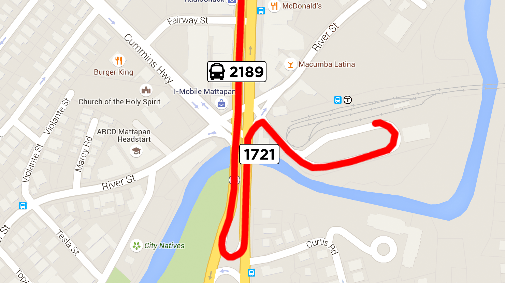
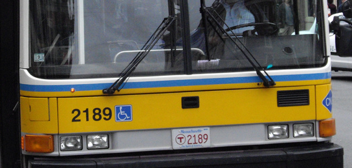

## 3. Introduction to Vehicle Positions

A vehicle position message communicates the physical location of a bus,
train, ferry or otherwise. In addition to location of the vehicle, it
can also provide information about the vehicle's speed, bearing (the
direction it is facing), and how to match up the vehicle with a trip in
the static schedule.

A recent addition to the GTFS-realtime specification (experimental at
time of writing -- see
<https://developers.google.com/transit/gtfs-realtime/changes>) is the
ability to indicate how full a vehicle is. Although this element is not
yet formally a part of the specification, it has been included in this
book so it aligns with current documentation.

### Sample Feed

The following extract is from the vehicle position feed of MBTA in
Boston (<https://openmobilitydata.org/p/mbta/92>). MBTA also provide separate
feeds for service alerts and trip updates.

This extract contains a single GTFS-realtime entity, which represents a
single vehicle position.

```
entity {
  id: "v1211"
  
  vehicle {
    trip {
      trip_id: "25906883"
      start_date: "20150117"
      schedule_relationship: SCHEDULED
      route_id: "28"
    }
    
    position {
      latitude: 42.267967
      longitude: -71.093834
    }
    
    current_stop_sequence: 35
    timestamp: 1421565564
    stop_id: "1721"
    
    vehicle {
      id: "y2189"
      label: "2189"
    }
  }
}
```

***Note:** This extract has been converted from its binary format into a
human-readable version. *Outputting Human-Readable GTFS-realtime Feeds*
shows you how this is achieved.*

Rendering the vehicle position and its path on a map along with the
referenced stop looks as follows.



The elements of the vehicle position are described below. The outer
`vehicle` element in this entity is of type `VehiclePosition`. The
inner `vehicle` element is a `VehicleDescriptor`, which is described
shortly.

### Trip

If specified, this element is used to link the vehicle position to a
specific trip in the corresponding GTFS feed, or to a trip that has been
added to the schedule. Using MBTA's GTFS feed, you can determine that
the trip can be matched to the record below. You can find this in the
trips.txt file at
<https://openmobilitydata.org/p/mbta/64/latest/file/trips.txt>.

| `route_id` | `service_id`                   | `trip_id` | `trip_headsign`                      |
| :--------- | :----------------------------- | :-------- | :-------------- |
| 28         | BUSS12015-hbs15no6-Saturday-02 | 25906883  |  Mattapan Station via Dudley Station |

**Note:** If the schedule_relationship value was ADDED or UNSCHEDULED,
there would not have been a corresponding record in trips.txt.

If you then look up the trip's records in stop_times.txt, you can
determine the trip begins at 25:45:00. This means the trip begins at
1:45 AM on the morning following its service date. In this case, the
start date in the vehicle position is specified as January 17. This
means that this trip actually takes place on the morning of January 18.
If the start date was not included with the vehicle position, it may
have been difficult to determine the specific trip being referenced.

### Position

This element contains the geographic location of the vehicle. In this
instance, only the latitude and longitude are specified. It is also
possible to include the vehicle's bearing, odometer and speed, however
only that latitude and longitude are required.

### Current Stop

A vehicle position can include information about its position relative
to its current or next stop.

The status of the stop is indicated by the `current_status` value. In
this example, the `current_status` is not specified, which means the
vehicle is currently in transit to the stop (in other words, it is not
stopped there, nor is it about to stop).

The stop referred to in this instance has a `stop_id` of `1721`.
Referring once again to the MBTA GTFS feed
(<https://openmobilitydata.org/p/mbta/64/latest/stop/1721>), this stop is as
follows.

| `stop_id` | `stop_code` | `stop_name`               | `stop_lat` | `stop_lon` |
| :-------- | :---------- | :------------------------ | :--------- | :--------- |
| 1721      |   1721      |  Blue Hill Ave @ River St | 42.267151  | -71.09362  |

The other value used to identify the upcoming or current stop is the
`current_stop_sequence` value. This refers to the `stop_sequence`
value in `stop_times.txt`.

***Note:** Technically, you can infer the stop based on the trip and
current_stop_sequence value, so you do not strictly need the stop_id
value. However, in some cases it may not be possible to identify the
trip (and therefore not be able to infer the specific stop), so having
the `stop_id` value available in the vehicle position is useful.*

By looking up the stop ID and trip ID in `stop_times.txt`, you can
locate the following entry:

| `trip_id` | `stop_sequence` | `stop_id` | `arrival_time` | `departure_time` |
| :-------- | :-------------- | :-------- | :------------- | :--------------- |
| 25906883  | 35              | 1721      | 26:14:00       | 26:14:00         |

***Note:** Remember that an hour value of 26 corresponds to 2 AM on the
following day (in this instance, the trip value specifies the trip's
date as January 17, so this stop time is 2 AM on January 18).*

In plain English, this can be interpreted as "the vehicle is currently
in transit to stop 1721, scheduled to arrive at 2:14 AM." Note however,
that the timestamp value corresponds to 2:19 AM, meaning the bus is
about 5 minutes late.

Tip: You can quickly find the human-readable version of a timestamp
using the command-line tool date. You may need to set the local timezone
first. In this instance, Boston's timezone can be set using export
TZ=America/New_York. You can then use date -r 1421565564 to find the
value of Sun 18 Jan 2015 02:19:24 EST.

### Vehicle Descriptor

The vehicle descriptor provides information to identify the specific
vehicle. In this example, the internal vehicle identifier is `y2189`.
It should remain consistent for this particular vehicle across the
system. Any subsequent vehicle positions or trip updates that refer to
this vehicle should use the same identifier.

The vehicle ID value is not intended to be presented to end-users.
Instead, the label field should be used. The label could refer to a
particular train number, or perhaps a number painted on the side of a
bus. In the case of vehicle 2189, the number appears as in the following
photograph.



The other piece of identifying information that can be presented to
users is the license plate of the vehicle. The MBTA's feed doesn't
specify this value, presumably because it duplicates the `label`
value.

### Improvements

Although this sample vehicle position contains the most pertinent
information (the coordinates of the vehicle and its corresponding trip),
knowing the direction that the vehicle is facing can also be useful.

A common way of presenting vehicle positions on a map is to show all
positions for a given route on a map. If you can provide this extra
piece of information, a passenger can look at a map of all vehicle
positions for a given route and determine which are traveling in their
desired direction, and which are traveling in the opposite direction.

***Note:** When you can match up a vehicle position to a specific trip,
it may be possible to filter which vehicles appear on the map using the
`direction_id` value for the trip. In some instances though, you may only
know the route of a vehicle and not its specific trip.*

*Chapter 7. Consuming Vehicle Positions* shows you how to
determine the bearing of a vehicle if it is not included by the data
provider.

### Specification

This section contains the specification for the `VehiclePosition`
entity type. Some of this information has been sourced from the
GTFS-realtime reference page
(<https://developers.google.com/transit/GTFS-realtime/reference>).

### VehiclePosition

A `VehiclePosition` element is used to specify the geographic position
and other attributes of a single vehicle, as well as providing
information to match that vehicle back to the corresponding GTFS feed.

| Field | Type | Frequency | Description |
| :---- | :--- | :-------- | :---------- |
| `trip`                  | `TripDescriptor`                   | Optional | This is used to match the vehicle position to a specific trip from `trips.txt` in the corresponding GTFS feed. |
| `vehicle`               | `VehicleDescriptor`                | Optional | This element provides information that can be used to identify a particular vehicle. |
| `position`              | `Position`                         | Optional | The vehicle's geographic location, bearing and speed are specified using the `Position` type. |
| `current_stop_sequence` | `int32` (32-bit signed integer)    | Optional | The sequence of the current stop, as it appears in the `stop_sequence` value for the trip matched in the corresponding `stop_times.txt` file. |
| `stop_id`               | `string`                           | Optional | This is used to identify the current stop. If specified, the `stop_id` value must correspond to an entry in the `stops.txt` file of the corresponding GTFS feed. |
| `current_status`        | `VehicleStopStatus`                | Optional | If the current stop is specified (using `current_stop_sequence`), this value specifies what the "current stop" means. If this value isn't specified, it is assumed to be `IN_TRANSIT_TO`. |
| `timestamp`             | `uint64` (64 bit unsigned integer) | Optional | This value refers to the moment at which the vehicle's position was measured, specified in number of seconds since 1-Jan-1970 00:00:00 UTC. |
| `congestion_level`      | `CongestionLevel`                  | Optional | This value indicates the status of the traffic flow the vehicle is currently experiencing. The possible values for this element are listed below this table. |
| `occupancy_status`      | `OccupancyStatus`                  | Optional | At time of writing, this field is experimental only. If specified, it indicates how full a given vehicle is. |

The possible values for the `VehicleStopStatus` enumerator are as
follows:

| Value | Description |
| :---- | :---------- |
| `INCOMING_AT` | The vehicle is just about to arrive at the specified stop. In some vehicles, there is a visual display or audio announcement when approaching the next stop. This could correspond with `current_status` changing from `IN_TRANSIT_TO` to `INCOMING_AT`. |
| `STOPPED_AT` | The vehicle is currently stationary at the stop. Once it departs the `current_status` would update to `IN_TRANSIT_TO`. |
| `IN_TRANSIT_TO` | The vehicle has departed the previous stop and is on its way to the specified stop. This is the default value if `current_status` is not specified. |

The possible values for the `CongestionLevel` enumerator are as
follows:

| Value | Description |
| :---- | :---------- |
| `UNKNOWN_CONGESTION_LEVEL` | If the congestion level is not specified, then this is the default value. |
| `RUNNING_SMOOTHLY` | Traffic is flowing smoothly. |
| `STOP_AND_GO` | Traffic is flowing, but not smoothly. |
| `CONGESTION` | The vehicle is experiencing some level of congestion, and therefore likely to be moving very slowly. |
| `SEVERE_CONGESTION` | The vehicle is experiencing a high level of congestion, and therefore likely to be not moving. |

While this information can be useful to present to the user, it does not
allow you to make any inference as to whether the vehicle will adhere to
its schedule. Schedules are often designed to account for levels of
congestion, depending on the time of day.

For this value to be useful in telling a user why their vehicle may be
late, the GTFS `stop_times.txt` would likely also need a field to
indicate the expected congestion level for any given stop time.
Realistically though, this is where the `TripUpdate` element comes
into play. This is covered in *Chapter 4. Introduction to Trip Updates*.

### TripDescriptor

The meaning of the trip descriptor differs slightly for a vehicle
position than for a service alert. In a service alert, if the
`route_id` is specified but the `trip_id` is not, then the service
alert applies to all trips for that route.

In the case of a vehicle position, if the `route_id` is specified but
not the `trip_id`, then it means the vehicle position corresponds to
"some" trip for that route, not "all" trips (it does not make sense for
it to apply to all trips).

This means that if a user wants to know the vehicle positions for a
given route, you can show them all known positions, even if you are
unable to match the trip back to a trip in the corresponding GTFS feed.

Refer to Chapter 4 for a description of all elements in a
`TripDescriptor`.

### VehicleDescriptor

This element is used to identify a specific vehicle, both internally and
for passengers. Every single vehicle in the system must have its own
identifier, and it should carry across all vehicle positions and trip
updates that correspond to the specific vehicle.

| Field | Type | Frequency | Description |
| :---- | :--- | :-------- | :---------- |
| `id`            | `string` | Optional | A unique identifier for a vehicle. This value is not intended to be shown to passengers, but rather for identifying the vehicle internally. |
| `label`         | `string` | Optional | A label that identifies the vehicle to passengers. Unlike the `id` value, this value may be repeated for multiple vehicles, and it may change for a given vehicle over the course of a trip or series of trips. This might correspond to a route number that is displayed on a bus, or a particular train number, or some other identifier that passengers can see. |
| `license_plate` | `string` | Optional | The license plate of the vehicle. |

### Position

This element specifies the geographic position of a vehicle, as well as
related attributes such as bearing and speed.

| Field | Type | Frequency | Description |
| :---- | :--- | :-------- | :---------- |
| `latitude`  | `float`  | Required | The latitude of the vehicle (a number in the range of `-90` to `90`). |
| `longitude` | `float`  | Required | The longitude of the vehicle (a number in the range of `-180` to `180`). |
| `bearing`   | `float`  | Optional | Degrees, clockwise from True North. 0 is North, 90 is East, 180 is South, 270 is West. This can be either the direction the vehicle is facing, or the direction towards the next stop (GTFS-realtime does not provide a mechanism to determine which). |
| `odometer`  | `double` | Optional | A measure of distance in meters. The GTFS-realtime specification does not state exactly what this value should represent. It could represent either the total number of meters the vehicle has ever travelled, or the number of meters travelled since the beginning of its current trip. |
| `speed`     | `float`  | Optional | The speed of the vehicle at the time of the reading, in meters per second. |

While the latitude and longitude are the most important pieces of
information in this element, the vehicle's bearing can also be useful
to know. *Determining a Vehicle's Bearing* shows you how to
determine the bearing if it is not specified.

### OccupancyStatus

***Warning:** At time of writing the OccupancyStatus enumerator is
considered experimental only.*

This enumerator is used for indicating how full a vehicle is. This can
be useful for warning passengers waiting for this vehicle that they may
not be able to fit and should instead attempt to use a different
vehicle.

| Value | Description |
| :---- | :---------- |
| `EMPTY` | Used to indicate there are no (or very few) passengers on board. |
| `MANY_SEATS_AVAILABLE` | The vehicle is not empty, but it has many seats available. |
| `FEW_SEATS_AVAILABLE` | The vehicle has some seats available and is still accepting passengers. |
| `STANDING_ROOM_AVAILABLE` | The vehicle is still accepting passengers, but they will have to stand. |
| `CRUSHED_STANDING_ROOM_ONLY` | The vehicle is still accepting passengers, but they will have to stand and there is very limited space. |
| `FULL` | The vehicle is considered full but may still be accepting new passengers |
| `NOT_ACCEPTING_PASSENGERS` | The vehicle is not accepting new passengers. |

