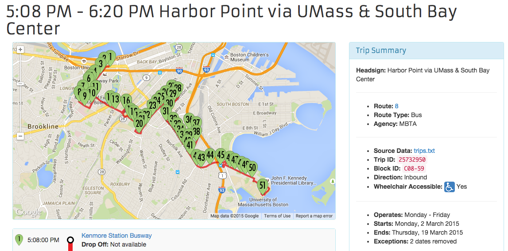
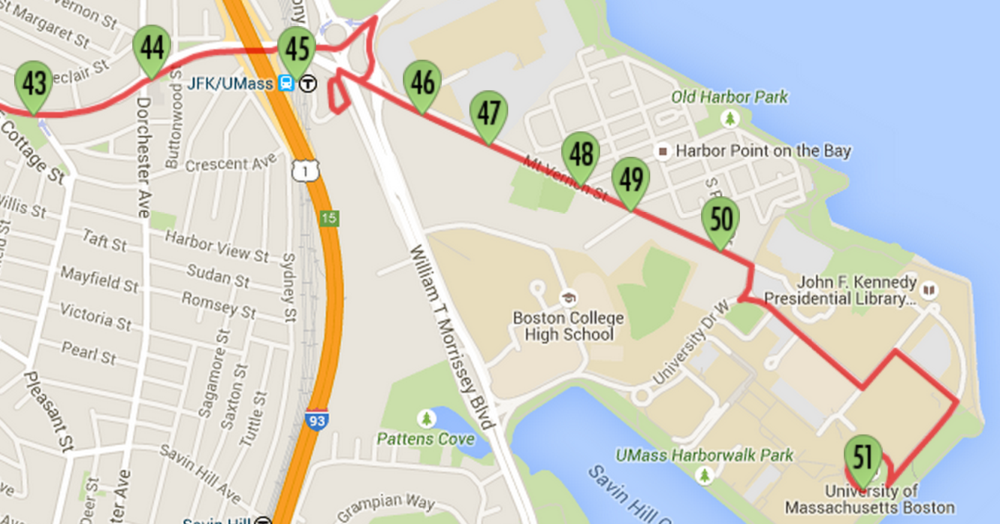
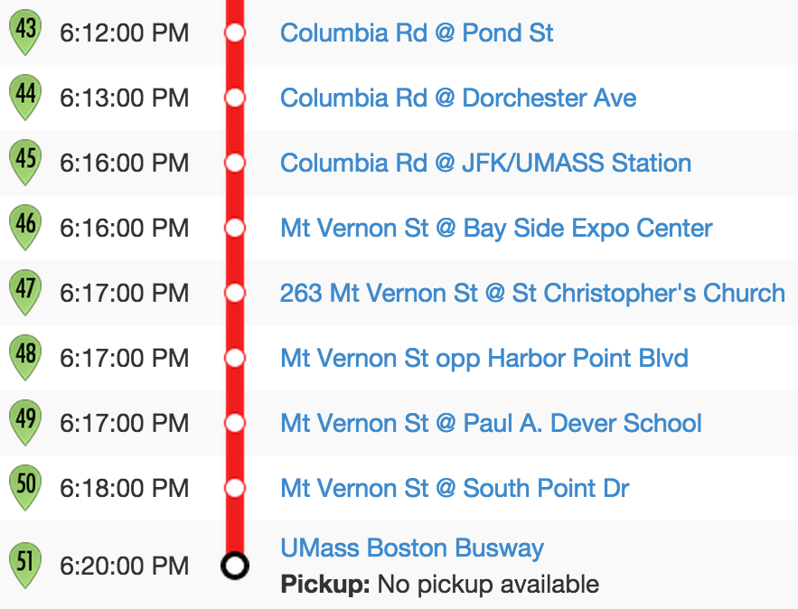

## 4. Introduction to Trip Updates

A trip update message is used to report the progress of a vehicle along
its trip. Each trip may only have one trip update message in a
GTFS-realtime feed.

A trip update can report that a trip has been canceled, or it can update
the progress of any number of stops on the trip. For example, a trip
update may contain an arrival estimate only for the vehicle's next
stop, or it may contain estimates for every remaining stop on the trip.

If a trip does not have a trip update message, this should be
interpreted as there being no real-time information available; not that
it is necessarily progressing as scheduled.

### Sample Feed

The following extract is from the MBTA trip update feed
(<https://openmobilitydata.org/p/mbta/91>). MBTA also provide separate feeds
for service alerts and vehicle positions.

This extract contains a single GTFS-realtime entity, which represents a
bus that is four minutes behind schedule (a `delay` value of `240`
seconds).

```
entity {
  id: "25732950"
  
  trip_update {
    trip {
      trip_id: "25732950"
      start_date: "20150120"
      schedule_relationship: SCHEDULED
      route_id: "08"
    }
    
    stop_time_update {
      stop_sequence: 43
      arrival {
        delay: 240
      }
      stop_id: "135"
    }
    
    vehicle {
      id: "y2189"
      label: "2189"
    }
  }
}
```

***Note:** This extract has been converted from its binary format into a
human-readable version. *Outputting Human-Readable GTFS-realtime Feeds*
shows you how this is achieved.*

The elements of a `trip_update` entity are as follows.

### Trip

This element is used to identify the particular trip that a trip update
applies to. In this instance, the trip has an ID of `25732950`,
running on the service day of 20 January 2015.



***Note:** Although this trip may no longer be active, you can view
similar trips at <https://openmobilitydata.org/p/mbta/64/latest/route/8>.*

Since the `schedule_relationship` value is `SCHEDULED`, this trip
corresponds to a trip in the MBTA GTFS file
(<https://openmobilitydata.org/p/mbta/64>).

If the `schedule_relationship` value is `ADDED`, then this
corresponds to a new trip for the route with an ID of `08`. The
`stop_time_added` field would likely then contain an entry for each
stop on the added trip.

***Note:** The trip could also be marked as CANCELED. If so, the trip
could either be in the GTFS feed or it may have been added through a
previous trip update message.*

### Stop Time Update

The `stop_time_update` elements contains information specific to a
stop on the trip. It is repeated for each stop that there is information
for. If the trip has been canceled (indicated by a
`schedule_relationship` value of `CANCELED`) then there will no
`stop_time_update` elements.

In the above sample, there is a single update, corresponding to the stop
with an ID of `135`. You can look up the details of this stop at
<https://openmobilitydata.org/p/mbta/64/latest/stop/135>. This stop has a
stop sequence of 43, as shown in the following figure.



Referring to the `stop_times.txt` file in the GTFS feed, the scheduled
arrival time for this trip at stop 135 is 6:12 PM. The delay value
indicates that it will be four minutes late (240 seconds), meaning it
will now arrive at 6:16 PM.



As there are no additional stop time updates for subsequent updates, it
can be assumed that this delay carries through to the rest of the trip.
There are eight remaining stops after this one, so all of those will
also be four minutes late.

### Vehicle

The vehicle information is useful as it enables you to identify specific
vehicles. In this instance, MBTA use the same identifier both as their
internal identifier and also as the identifier printed on the bus. This
sample once again refers to bus `2189`. The photograph in *Chapter 3: Vehicle Positions*
shows how this number appears on the vehicles.

### Specification

This section contains the specification for the `VehiclePosition`
entity type. Some of this information has been sourced from the
GTFS-realtime reference page
(<https://developers.google.com/transit/GTFS-realtime/reference>).

### TripUpdate

| Field | Type | Frequency | Description |
| :---- | :--- | :-------- | :---------- |
| `trip`             | `TripDescriptor`                   | Optional | This element is used to match the referenced trip to `trips.txt` file from the corresponding GTFS feed. |
| `vehicle`          | `VehicleDescriptor`                | Optional | This element provides information that can be used to identify a particular vehicle. |
| `stop_time_update` | `StopTimeUpdate`                   | Repeated | This element contains one or more instances of `StopTimeUpdate`. Each occurrence represents a prediction for a single stop. They must be in order of their stop sequence. |
| `timestamp`        | `uint64` (64-bit unsigned integer) | Optional | This value refers to the moment at which the real-time progress was measured, specified in number of seconds since 1-Jan-1970 00:00:00 UTC. |
| `delay`            | `int32` (32-bit signed integer)    | Optional | This value is only experimental at time of writing. It is used to indicate the number of seconds the vehicle is either early (negative number) or late (positive number). Estimates specified within `StopTimeUpdate` elements take precedence over this value. |

### TripDescriptor

Identifying a trip in a trip update is slightly different to identifying
a trip in a service alert or vehicle position message. With vehicle
positions and service alerts, the trip descriptor may refer to an
arbitrary trip for a given route, but to do so with trip updates does
not make sense.

With trip updates, you must be able to identify a specific trip from the
corresponding GTFS feed. This is because trip updates will often only
include an update for a single stop, and you must therefore determine
subsequent stop times for a given trip so those can be adjusted
accordingly. To do so, you need to be able to find a specific trip and
its corresponding stop times in the GTFS feed.

This differs to a service alert where you can apply an alert to all
trips for a given route, rather than one at a specific time. It also
differs to vehicle positions, where being able to see all positions for
a route on a map is useful, even if you do not know the specific trip
each position corresponds to.

### VehicleDescriptor

This element is used to identify a specific vehicle, both internally and
for passengers. Every single vehicle in the system must have its own
identifier, and it should carry across all vehicle positions and trip
updates that correspond to the specific vehicle.

| Field | Type | Frequency | Description |
| :---- | :--- | :-------- | :---------- |
| `id`            | `string` | Optional | A unique identifier for a vehicle. This value is not intended to be shown to passengers, but rather for identifying the vehicle internally. |
| `label`         | `string` | Optional | A label that identifies the vehicle to passengers. Unlike the `id` value, this value may be repeated for multiple vehicles, and it may change for a given vehicle over the course of a trip or series of trips. This might correspond to a route number that is displayed on a bus, or a particular train number, or some other identifier that passengers can see. |
| `license_plate` | `string` | Optional | The license plate of the vehicle. |

### StopTimeUpdate

| Field | Type | Frequency | Description |
| :---- | :--- | :-------- | :---------- |
| `stop_sequence`         | `uint32` (32-bit unsigned integer) | Optional | In GTFS feeds, the order of stops in a trip is indicated by the `stop_sequence` value in `stop_times.txt`. If specified, the value specified in the `StopTimeUpdate` must match the value from the GTFS feed. It is possible for a single trip to make multiple visits to a single stop (for example, if it's a loop service), so this value is important. |
| `stop_id`               | `string`                           | Optional | This value corresponds to a single stop from the associated GTFS feed. Using this value and the `stop_sequence` value, it is possible to pinpoint a specific record from `stop_times.txt` that this `StopTimeUpdate` element alters. |
| `arrival`               | `StopTimeEvent`                    | Optional | Specifies the updated arrival time. If the `schedule_relationship` is `SCHEDULED`, then this field and/or `departure` must be specified. |
| `departure`             | `StopTimeEvent`                    | Optional | Specifies the updated departure time. If the `schedule_relationship` is `SCHEDULED`, then this field and/or `arrival` must be specified. |
| `schedule_relationship` | `ScheduleRelationship`             | Optional | If no value is specified, this defaults to `SCHEDULED`. Other possible values and their meanings are as described below. |

Valid values for the `ScheduleRelationship` enumerator are:

| Value | Description |
| :---- | :---------- |
| `SCHEDULED` | Indicates this stop occurs in accordance with the scheduled trip, although the arrival or departure times may be different from the times listed in the GTFS `stop_times.txt` file. |
| `SKIPPED` | Indicates that the corresponding stop will be skipped for the given trip. The arrival or departure times may still be included, but the vehicle will not be stopping. |
| `NO_DATA` | This is the value that should be used if no real-time information is available for this stop. In this case, neither `arrival` nor `departure` should be specified (if they are, you can safely ignore them). |

### StopTimeEvent

| Field | Type | Frequency | Description |
| :---- | :--- | :-------- | :---------- |
| `delay`       | `int32` (32-bit signed integer) | Optional | The number of seconds that a vehicle is early (a negative value) or late (a positive value). A value of `0` indicates the vehicle is exactly on time. |
| `time`        | `int64` (64-bit signed integer) | Optional | The time of the arrival or departure, specified in number of seconds since 1-Jan-1970 00:00:00 UTC. |
| `uncertainty` | `int32` (32-bit signed integer) | Optional | Represents the level of uncertainty attached to this prediction in seconds. A value of `0` means is it completely certain, while an omitted value means an unknown level of uncertainty. |

Either the delay or exact time must be specified. If both are specified,
then the scheduled time in GTFS added to the delay should equal the
`time` value. If it does not, just the `time` value can be used.

Conversely, if the `delay` value is not specified, you can calculate
it by subtracting the GTFS scheduled time from the predicted `time`
value.

***Note:** Your interpretation of what constitutes a delay is likely to
depend on how you are presenting real-time data. For instance, if you
present arrivals to your users as "Early", "On-Time" and "Late", it is
likely to be more useful to your users to indicate a 30-second delay as
being "On-Time" rather than "Late".*

The `uncertainty` field is used to indicate the accuracy of the
prediction. For example, consider a prediction that indicates a bus will
be five minutes late. If the transit agency thinks the prediction is
within a minute on either side of five minutes (say, 4-6 minutes late),
then the uncertainty value is the difference between the minimum and
maximum value. In this example, the uncertainty is 2 minutes -- a value
of `120` seconds.

