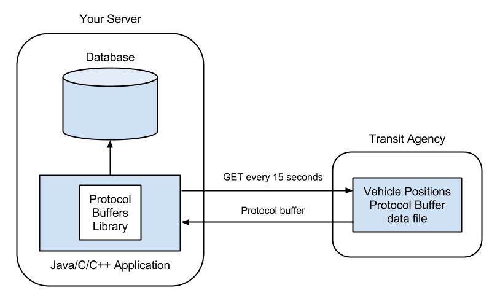

## 5. Protocol Buffers

The previous chapters have included extracts from GTFS-realtime feeds in
a human-readable format. This data is actually represented using a data
format called *Protocol Buffers*.

Developed by Google and initially released in 2008, Protocol Buffers are
a way of serializing structured data into a format which is intended to
be smaller and faster than XML.

Note: Remember, if you are writing a transit-related mobile app,
GTFS-realtime feeds are not intended to be consumed directly by mobile
devices due to the large amount of data transferred. Rather, you will
need an intermediate server to read the feed from the provider then
serve only relevant data to the mobile devices running your app.

Even though it looks similar to JSON data, the human-readable version of
a protocol buffer is not intended to be manually parsed. Instead, data
is extracted from a protocol buffer using native language (such as Java,
C++ or Python).

Note: Although the Protocol Buffers application can generate code in
Java, C++ or Python, all code examples in this book will be in Java.

For example, assume you have written a Java program that reads and
parses a GTFS-realtime service alerts feed (shown later in this chapter,
and in the next chapter).

In order to consume a GTFS-realtime feed provided by a transit agency
such as TriMet or MBTA, your workflow would look similar to the
following diagram:



When a transit agency or data provider want to publish a GTFS-realtime
feed, their process would be similar, except instead of reading the feed
every 15 seconds, they would write a new protocol buffer data file every
15 seconds using data received from their vehicles.

***Note:** *Chapter 11. Publishing GTFS-realtime Feeds* will
show you how to create a GTFS-realtime feed using Protocol Buffers. In
order to do so, you will need to install Protocol Buffers as
demonstrated in this chapter.*

### Installing Protocol Buffers

In order to generate code to read or write GTFS-realtime feeds in your
native language, you first need to install Protocol Buffers. Once
installed, it is capable of generating code for Java, C++ or Python.

This section shows you how to download and build the `protoc`
command-line tool on a UNIX or Linux-based system. These instructions
were derived from installing Protocol Buffers on Mac OS X 10.10.

First, download and extract the Protocol Buffers source code. At the
time of writing, the current version is 2.6.1.

```
$ curl -L \
    https://github.com/google/protobuf/releases/download/v2.6.1/protobuf-2.6.1.tar.gz \
    -o protobuf-2.6.1.tar.gz

$ tar -zxf protobuf-2.6.1.tar.gz

$ cd protobuf-2.6.1
```

***Note:** Visit <https://developers.google.com/protocol-buffers/> and
click the "Download" link to find the latest version. The following
instructions should still work for subsequent versions.*

Next, compile the source files using `make`. First run the
`configure` script to build the `Makefile`, then run `make`.

```
$ ./configure && make
```

***Note:** Separating the commands by && means that make will only run if
`./configure` exits successfully.*

Once compilation is complete, you can verify the build by running **make
check**. You can then install it globally on your system using **make
install**. If you do not want to install it globally, you can run
`protoc` directly from the **./src** directory instead.

```
$ make check

$ make install
```

Next verify that it has been successfully built and installed by running
the `protoc` command. The output should be "Missing input file."

```
$ protoc

Missing input file.
```

The next section will show you how to generate Java files using
`protoc` and the `gtfs-realtime.proto` file.

### Introduction to gtfs-realtime.proto

In order to generate source code files that can read a protocol buffer,
you need a `.proto` input file. Typically you won't need to create or
modify `.proto` files yourself, it is useful to have a basic
understanding of how they work.

A `.proto` file contains a series of instructions that defines the
structure of the data. In the case of GTFS-realtime, there is a file
called `gtfs-realtime.proto` which contains the structure for each of
the messages available (service alerts, vehicle positions and trip
updates).

The following is an extract from `gtfs-realtime.proto` for the
`VehiclePosition` message.

**Note: **The `TripDescriptor` and `VehicleDescriptor` types
referenced in this extract also have declarations, which are not
included here.

```
message VehiclePosition {
    optional TripDescriptor trip = 1;
    optional Position position = 2;
    optional uint32 current_stop_sequence = 3;
    
    enum VehicleStopStatus {
        INCOMING_AT = 0;
        STOPPED_AT = 1;
        IN_TRANSIT_TO = 2;
    }
    
    optional VehicleStopStatus current_status = 4 [default = IN_TRANSIT_TO];
    optional uint64 timestamp = 5;
    
    enum CongestionLevel {
        UNKNOWN_CONGESTION_LEVEL = 0;
        RUNNING_SMOOTHLY = 1;
        STOP_AND_GO = 2;
        CONGESTION = 3;
        SEVERE_CONGESTION = 4;
    }
    
    optional CongestionLevel congestion_level = 6;
    optional string stop_id = 7;
    optional VehicleDescriptor vehicle = 8;
    extensions 1000 to 1999;
}
```

Ignoring the numerical values assigned to each field (they aren't
likely to be relevant because you never directly refer to them), you can
see how the structure is the same as the specification covered earlier
in this book for vehicle positions.

Each field in a protocol buffer has a unique value assigned to it. This
value is used internally when encoding or decoding each field in
GTFS-realtime feed. If there is additional data to be represented in a
feed, the values between 1000 and 1999 are reserved for extensions.
*Chapter 10. GTFS-realtime Extensions* shows how extensions in
GTFS-realtime work.

### Compiling gtfs-realtime.proto

The next step towards consuming a GTFS-realtime feed is to compile the
`gtfs-realtime.proto` file into Java code using `protoc`. In order
to do this, you must have already created a Java project ahead of time.
`protoc` will generate the files and incorporate them directly into
your project's source tree.

These instructions assume you have created your Java project in
**/path/to/gtfsrt** and that you will download the
`gtfs-realtime.proto` file to **/path/to/protobuf**.

First, download the `gtfs-realtime.proto` file.

```
$ cd /path/to/protobuf

$ curl \
    https://developers.google.com/transit/gtfs-realtime/gtfs-realtime.proto \
    -o gtfs-realtime.proto
```

***Note:** If this URL is no longer current when you read this, you can
find the updated location at
<https://developers.google.com/transit/gtfs-realtime/>.*

In order to use `protoc`, you must specify the **--proto_path**
argument as the directory in which `gtfs-realtime.proto` resides.
Additionally, you must specify the full path to the
`gtfs-realtime.proto` file.

Typically, in a Java project your source files will reside in a
directory called `src` within the project directory. This directory
must be specified in the **--java_out** argument.

The full command to run is as follows:

```
$ protoc \
    --proto_path=/path/to/protobuf \
    --java_out=/path/to/gtfsrt/src \
    /path/to/protobuf/gtfs-realtime.proto
```

If this command runs successfully there will be no output to screen, but
there will be newly-created files in your source tree. There should now
be a **./com/google** directory in your source tree, and a package
called `com.google.transit.realtime`.

### Adding the Protocol Buffers Library

Before you can use this new package, you must add the Protocol Buffers
library to your Java project. You can either compile these files into a
Java archive (using the instructions in
**./protobuf-2.6.**1**/java/README.txt**), or you can add the Java
source files directly to your project as follows:

```
$ cd protobuf-2.6.1

$ cp -R ./java/src/main/java/com/google/protobuf \
    /path/to/gtfsrt/src/com/google/
```

If you now try to build your project, an error will occur due to a
missing package called `DescriptorProtos`. You can add this to your
project using the following command:

```
$ cd protobuf-2.6.1

$ protoc --java_out=/path/to/gtfsrt/src \
    --proto_path=./src \
    ./src/google/protobuf/descriptor.proto
```

Your project should now build successfully, meaning you can use the
`com.google.transit.realtime` package to read data from a
GTFS-realtime feed.

### Reading Data From a GTFS-realtime Feed

To read the data from a GTFS-realtime feed, you need to build a
`FeedMessage` object. The simplest way to do this is by opening an
`InputStream` for the URL of the GTFS-realtime feed.

The following code builds a `FeedMessage` for the vehicle positions
feed of the MBTA in Boston.

***Note:** To simplify the code listings in this book, package imports
are not included. All classes used are either standard Java classes, or
classes generated by Protocol Buffers.*

```java
public class YourClass {
    public void loadFeed() throws IOException {

        URL url = new URL("http://developer.mbta.com/lib/gtrtfs/Vehicles.pb");

        InputStream is = url.openStream();

        FeedMessage fm = FeedMessage.parseFrom(is);

        is.close();

        // ...
    }
}
```

A `FeedMessage` object contains zero or more entities, each of which
is either a service alert, a vehicle position, or a trip update. You can
retrieve a list of entities using **getEntityList()**, then loop over
them as follows:

```java
public class YourClass {
    public void loadFeed() throws IOException {

    // ...

    for (FeedEntity entity : fm.getEntityList()) {
        // Process the entity here
    }

    // ...

    }
}
```

Since many of the fields in GTFS-realtime are optional, you need to
check for the presence of the field you want to use before trying to
retrieve it. This is achieved using `hasFieldName()`. You can
then retrieve it using `getFieldName()`.

In the case of `FeedEntity`, you need to check which of the
GTFS-realtime messages are available. For instance, to check if the
entity contains a service alert, you would call `entity.hasAlert()`.
If the call to `hasAlert()` returns `true`, you can retrieve it
using `entity.getAlert()`.

The following code shows how to access the various entities.

```java
public class YourClass {
    public void loadFeed() throws IOException {
        // ...

        for (FeedEntity entity : fm.getEntityList()) {

            if (entity.hasAlert()) {
                Alert alert = entity.getAlert();

                // Process the alert here
            }

            if (entity.hasVehicle()) {
                VehiclePosition vp = entity.getVehicle();

                // Process the vehicle position here
            }

            if (entity.hasTripUpdate()) {
                TripUpdate tu = entity.getTripUpdate();

                // Process the trip update here
            }
        }

        // ...

    }
}
```

The next three chapters will show you how to process the `Alert`, `VehiclePosition` and `TripUpdate` objects.

### Outputting Human-Readable GTFS-realtime Feeds

Earlier chapters included human-readable extracts from GTFS-realtime
feeds. Although plain-text GTFS-realtime feeds are not designed to be
parsed directly, they can be useful for quickly determining the kinds of
data available within a feed.

All objects in a GTFS-realtime feed can be output using the
`TextFormat` class in the `protobuf` package. Passing the object to
**printToString()** will generate a human-readable version of the
GTFS-realtime element.

For instance, you can output an entire feed as follows:

```java
FeedMessage fm = ...;

String output = TextFormat.printToString(fm);

System.out.println(output);
```

Or you can output individual entities:

```java
for (FeedEntity entity : fm.getEntityList()) {
    String output = TextFormat.printToString(entity);
    
    System.out.println(output);
}
```

Alternatively, you can call the `toString()` method on these objects
to generate the same output.

